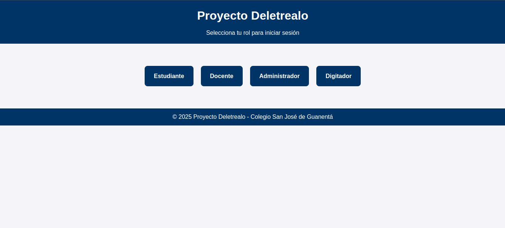
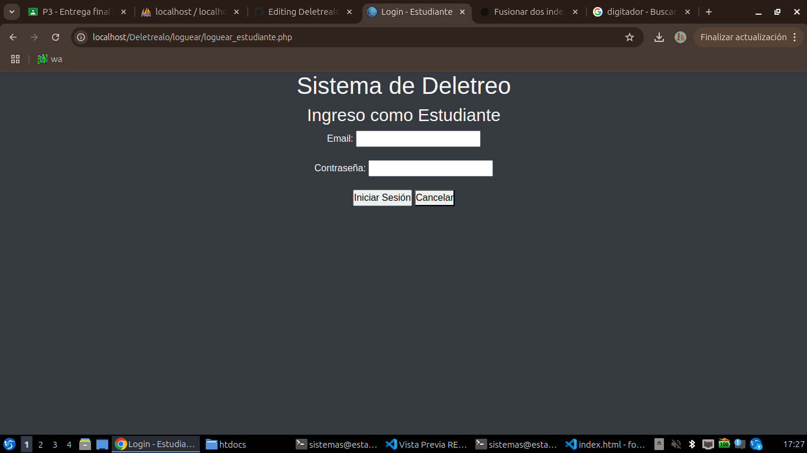
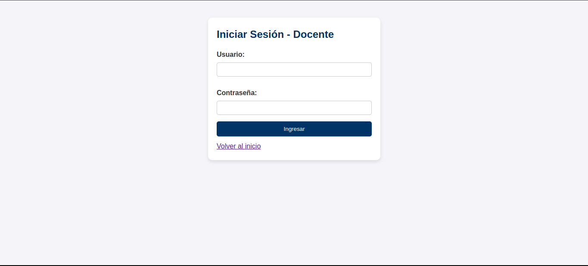
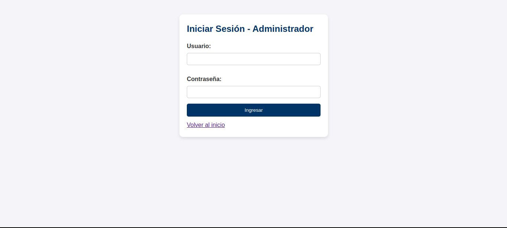

# Proyecto Deletrealo - Sitio Web

Este repositorio contiene la segunda versión del sitio web del proyecto **Deletrealo**, desarrollado en PHP, HTML y CSS.  
El sitio es **responsivo** (se adapta a diferentes tamaños de pantalla) y cuenta con secciones para los distintos usuarios del sistema.

---

## 📌 Estructura del sitio

- **index.html** → Página de inicio. Contiene la información general del proyecto y los accesos a las secciones de **Estudiante**, **Docente**, **Administrador** y **Digitador**.  
- **login_estudiante.html** → Formulario de inicio de sesión para estudiantes.  
- **login_docente.html** → Formulario de inicio de sesión para docentes.  
- **login_admin.html** → Formulario de inicio de sesión para administradores.  
- **login_digitador.html** → Formulario de inicio de sesión para digitadores.  
- **style.css** → Archivo de estilos para todo el sitio.  
- **/img/** → Carpeta con capturas de pantalla del sitio.

---

## 📷 Capturas de pantalla

### Página de inicio
  
*Muestra la página principal con la descripción del proyecto y los accesos a cada tipo de usuario.*

### Login Estudiante
  
*Formulario de inicio de sesión para estudiantes.*

### Login Docente
  
*Formulario de inicio de sesión para docentes.*

### Login Administrador
  
*Formulario de inicio de sesión para administradores.*

### Login Digitador
  
*Formulario de inicio de sesión para digitadores.*

---

## 📂 Repositorio en GitHub

El código y las versiones del sitio web están disponibles en el siguiente enlace:  
👉 [Mi repositorio en GitHub](https://github.com/Daniel-Abril68/Deletrealo.git)  

*(Reemplaza `USUARIO/REPO` por tu usuario y nombre real del repositorio en GitHub).*

---

## 🚀 Tecnologías utilizadas

- **HTML5** → Estructura del sitio.  
- **CSS3** → Estilos y diseño responsivo.  
- **Git & GitHub** → Control de versiones y despliegue del proyecto.

---